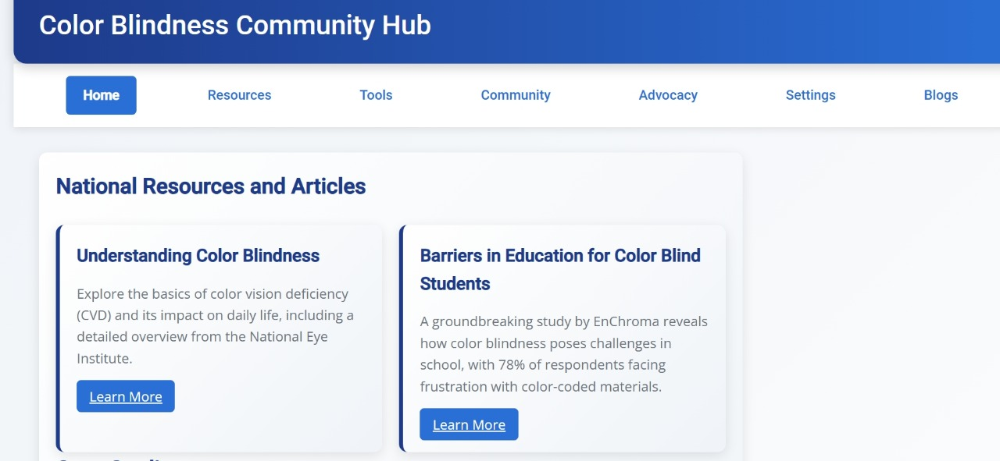

Problem Statement:
Color blindness impacts millions of individuals worldwide, creating barriers in certain fields, tasks, and industries where color plays a critical role. For example:
1. In electrical engineering, wire colors are essential for identifying functions, making it challenging for color-blind professionals to work efficiently and safely.
2. In elections, ballot designs often rely on color coding, which can confuse voters with color vision deficiencies.
3. Everyday activities, such as identifying color-coded information, interpreting charts, or using certain apps, are often not accessible to people with color blindness.

These challenges underline the need for inclusive tools, resources, and awareness to ensure equal opportunities and accessibility for color-blind individuals.

Proposed Solution:
Develop a comprehensive website with a built-in community hub to address the challenges faced by color-blind individuals. The website can include the following:

1. Resource Center:
   - Provide educational materials on color blindness, including guides, best practices, and information about tools like color-detection apps and simulators.
   - Share industry-specific solutions, such as techniques for safely identifying wire colors in electronics.

2. Interactive Tools:
   - Integrate features like a color identifier (using an image upload or real-time camera input) and a color blindness simulator to test designs for accessibility.

3. Community Hub:
   - A dedicated space for color-blind individuals and allies to connect, share experiences, and exchange solutions.
   - Discussion boards or forums categorized by topics (e.g., electronics, design, everyday accessibility).
   - Regular webinars, Q&A sessions, and blogs from experts and users to foster interaction and learning.

4. Inclusivity Advocacy:
   - Highlight success stories and initiatives that promote awareness about color-blind accessibility.
   - Include a feedback loop where community members can suggest features or share their needs for continuous improvement.

TECHNOLOGY STACK USED 
  - HTML (Create Structure of Webpage)
  - CSS (Style and Design the Webpage)
  - Java Script (To create the interactive Webpage)
  - Phython (Programming Algorithms)
  - Flask (Development Framework)
  - OpenCV (Image Processing)

Describe your Use Cases here:
 - Colorblind individuals in electronics can use the tool to identify resistor color codes and wire colors accurately, ensuring precise assembly and troubleshooting.
 - Designers with color blindness can upload graphics or design elements to identify colors, helping them create visuals that adhere to specific branding or design requirements.
 - Colorblind individuals planning home decoration can analyze furniture or room images to identify and name colors, making it easier to choose matching or complementary color schemes.
 - Uploading outfit images helps colorblind users identify clothing colors

